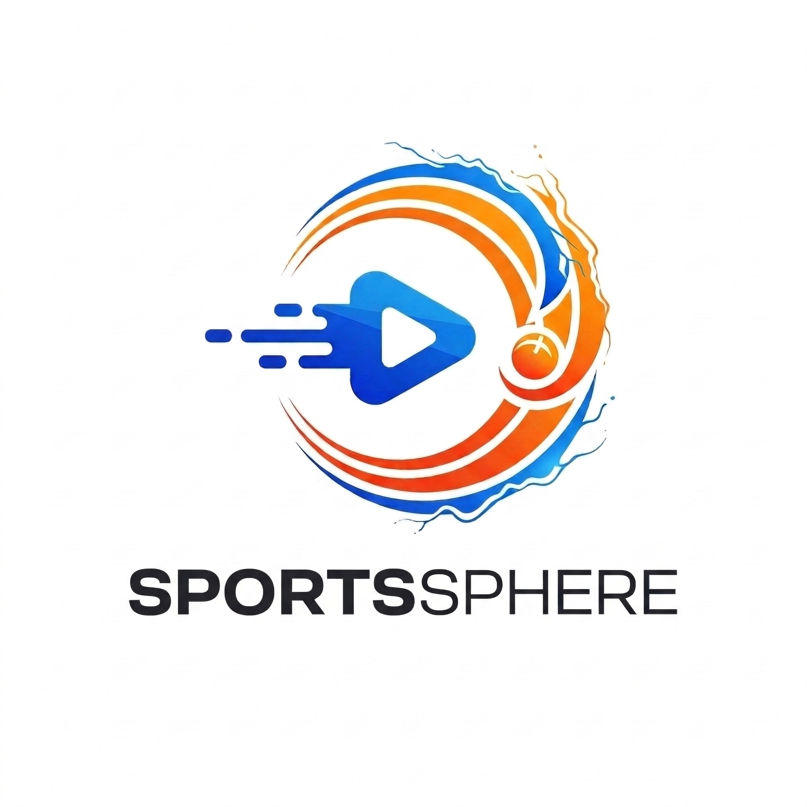

<p align="center">
  
</p>

<h1 align="center">⚽ Sports Sphere — Stremio Addon</h1>

<p align="center">
  <b>Aggregated live sports streams, directly in Stremio.</b><br/>
  Multi-source • Auto-resolving • Self-hostable
</p>

<p align="center">
  <a href="https://buymeacoffee.com/sportssphere"></a>
  
  
  
</p>

---

## 📖 Table of Contents

- [About](#-about)
- [Features](#-features)
- [Architecture Overview](#-architecture-overview)
- [Prerequisites](#-prerequisites)
- [Setup — Option 1: Docker (Recommended)](#-setup--option-1-docker-recommended)
- [Setup — Option 2: Running Directly with Python](#-setup--option-2-running-directly-with-python)
- [Environment Variables](#-environment-variables)
- [Installing the Addon in Stremio](#-installing-the-addon-in-stremio)
- [Troubleshooting](#-troubleshooting)
- [Contributing](#-contributing)
- [Support](#-support)
- [License](#-license)

---

## 🏟️ About

**Sports Sphere** is a self-hosted [Stremio](https://www.stremio.com/) addon that aggregates live sports events from multiple sources and delivers them as streamable content directly within the Stremio interface. It scrapes available matches, resolves embed URLs into playable `.m3u8` streams using a headless browser (Playwright), and serves them through a built-in proxy that handles CORS restrictions and anti-bot protections.

Whether you're watching football, basketball, F1, cricket, or any other sport — if it's live, Sports Sphere will find it and serve it to your Stremio client.

> **Note**: This addon is for **personal, educational use only**. The developers do not host, store, or distribute any media content. All streams are sourced from publicly available third-party APIs.

---

## ✨ Features

| Feature | Description |
|---|---|
| 🔴 **Live Sports Catalog** | Automatically fetches and displays all live sporting events for the day |
| 🔁 **Multi-Source Streams** | Aggregates streams from multiple providers per match, giving you backup options |
| 🧠 **Headless Stream Resolving** | Uses Playwright (headless Chromium) to resolve embed URLs into direct `.m3u8` links |
| 🛡️ **Built-in Proxy** | Proxies streams through your server to bypass CORS and referrer restrictions |
| 🔐 **HMAC URL Signing** | Prevents unauthorized use of your proxy server with cryptographic signatures |
| 🏎️ **Smart Caching** | Caches both the catalog (5 min) and resolved streams (15 min) for fast responses |
| 📦 **Docker Ready** | One-command deployment with Docker or Docker Compose |
| 🖼️ **Match Posters** | Displays event poster artwork in the Stremio catalog |
| 🏷️ **Genre Filtering** | Filter by sport category (Football, Basketball, F1, Cricket, etc.) |

---

## 🏗️ Architecture Overview

```
┌─────────────┐       ┌─────────────────────────┐       ┌────────────────┐
│   Stremio    │◄─────►│   Sports Sphere Server   │◄─────►│  streamed.pk   │
│   Client     │       │   (Quart + Playwright)   │       │  (Data Source) │
└─────────────┘       └───────────┬───────────────┘       └────────────────┘
                                  │
                          ┌───────▼───────┐
                          │  Proxy Engine │
                          │  (curl-cffi)  │
                          └───────────────┘
```

1. **Stremio** requests the catalog, meta, or stream endpoint from your server.
2. The server fetches today's matches from the upstream API and returns a catalog.
3. When a user clicks a match, the server resolves all available embed URLs using **Playwright** (headless Chromium).
4. Resolved `.m3u8` URLs are either returned directly or routed through the **built-in proxy** (for streams that require specific headers/referrers).

---

## 📋 Prerequisites

Before you begin, make sure you have the following depending on which setup method you choose:

### For Docker Setup
- [Docker](https://docs.docker.com/get-docker/) installed and running
- [Docker Compose](https://docs.docker.com/compose/install/) (included with Docker Desktop)

### For Python Setup
- **Python 3.10+** ([Download](https://www.python.org/downloads/))
- **pip** (comes with Python)
- **Git** ([Download](https://git-scm.com/downloads))

---

## 🐳 Setup — Option 1: Docker (Recommended)

Docker is the easiest and most reliable way to run Sports Sphere. The Dockerfile is pre-configured with the official Microsoft Playwright image and installs Google Chrome for Playwright, with Chromium kept as a fallback.

### Step 1: Clone the Repository

```bash
git clone https://github.com/Gregoryc28/SportsSphere
cd SportsStreams-Addon
```

### Step 2: Configure Environment Variables

Create a `.env` file in the project root (or edit the existing one):

```bash
PROXY_SECRET_KEY="your-super-secret-key-here"
```

> ⚠️ **Important**: Change the `PROXY_SECRET_KEY` to a long, random string. This key is used to sign proxy URLs with HMAC-SHA256 to prevent unauthorized access to your proxy server. Never share this key publicly.

You can generate a secure key with:

```bash
# Linux / macOS
openssl rand -hex 32

# Python
python -c "import secrets; print(secrets.token_hex(32))"
```

### Step 3: Build and Start with Docker Compose

```bash
docker-compose up -d --build
```

This will:
- Build the Docker image from the `Dockerfile`
- Install all Python dependencies from `requirements.txt`
- Install Google Chrome inside the container for Playwright
- Keep Chromium available as a fallback browser
- Start the server on port **8000**
- Automatically restart the container if it crashes

### Step 4: Verify It's Running

```bash
# Check container status
docker ps

# View logs
docker logs -f sports-sphere

# Test the manifest
curl http://localhost:8000/manifest.json
```

You should see a JSON response with the addon manifest.

### Managing the Container

```bash
# Stop the addon
docker-compose down

# Restart the addon
docker-compose restart

# Rebuild after code changes
docker-compose up -d --build

# View real-time logs
docker logs -f sports-sphere
```

### Docker Compose Configuration

The default `docker-compose.yml` is configured as follows:

```yaml
version: '3.8'

services:
  sports-sphere:
    build: .
    container_name: sports-sphere
    restart: unless-stopped
    ports:
      - "8000:8000"
    environment:
      - PORT=8000
      - PROXY_SECRET_KEY=your-super-secret-key-here  # Set your secret!
    volumes:
      - ./cache:/app/cache
```

> **Tip**: You can customize the port mapping (e.g., `"9000:8000"`) if port 8000 is already in use on your host machine.

---

## 🐍 Setup — Option 2: Running Directly with Python

If you prefer not to use Docker, you can run the addon directly on your system. This requires a bit more manual setup, especially for Playwright's browser dependencies.

### Step 1: Clone the Repository

```bash
git clone https://github.com/YOUR_USERNAME/SportsStreams-Addon.git
cd SportsStreams-Addon
```

### Step 2: Create a Virtual Environment

It's highly recommended to use a virtual environment to avoid conflicts with system-wide Python packages.

```bash
# Create the virtual environment
python -m venv .venv

# Activate it
# On Linux / macOS:
source .venv/bin/activate

# On Windows (PowerShell):
.\.venv\Scripts\Activate.ps1

# On Windows (CMD):
.\.venv\Scripts\activate.bat
```

### Step 3: Install Python Dependencies

```bash
pip install -r requirements.txt
```

This installs:

| Package | Purpose |
|---|---|
| `quart` | Async web framework (the server) |
| `quart-cors` | CORS support for Stremio compatibility |
| `playwright` | Headless browser for stream resolving |
| `requests` | HTTP client for API calls |
| `beautifulsoup4` | HTML parsing utilities |
| `curl-cffi` | TLS-impersonating HTTP client for the proxy |
| `uvicorn` | ASGI server to run the app in production |

### Step 4: Install Playwright Browsers

Playwright requires a Chromium browser binary to be installed. Run:

```bash
playwright install chromium
```

> **Note (Linux)**: If you're on a fresh Linux server, you may also need to install system-level dependencies. Run:
> ```bash
> playwright install-deps chromium
> ```
> This installs required libraries like `libatk`, `libcups`, `libnss3`, etc.

### Step 5: Configure Environment Variables

Set the `PROXY_SECRET_KEY` environment variable:

```bash
# On Linux / macOS (add to .bashrc or .zshrc for persistence):
export PROXY_SECRET_KEY="your-super-secret-key-here"

# On Windows (PowerShell):
$env:PROXY_SECRET_KEY="your-super-secret-key-here"

# Or simply create/edit the .env file:
echo 'PROXY_SECRET_KEY="your-super-secret-key-here"' > .env
```

### Step 6: Start the Server

You have two options for running the server:

#### Development Mode (with auto-reload)

```bash
python main.py
```

This starts the built-in Quart development server on `0.0.0.0:8000`.

#### Production Mode (recommended for long-running deployments)

```bash
uvicorn main:app --host 0.0.0.0 --port 8000
```

For better performance with multiple workers:

```bash
uvicorn main:app --host 0.0.0.0 --port 8000 --workers 2
```

> ⚠️ **Note on Workers**: Playwright can be memory-intensive. Each worker spawns its own headless browser instances. Start with 1–2 workers and monitor your system's RAM usage. A single worker is fine for personal use.

### Step 7: Verify It's Running

Open your browser or use `curl`:

```bash
curl http://localhost:8000/manifest.json
```

---

## ⚙️ Environment Variables

| Variable | Default | Description |
|---|---|---|
| `PROXY_SECRET_KEY` | `change-me-to-a-real-secret` | **Required**. Secret key used for HMAC-SHA256 signing of proxy URLs. Change this to a strong, unique value. |
| `PORT` | `8000` | The port the server listens on (when using Docker Compose). |

---

## 📺 Installing the Addon in Stremio

Once your server is running, you need to add it to Stremio:

1. **Find your server URL**:
   - If running locally: `http://localhost:8000/manifest.json`
   - If running on a VPS/remote server: `http://YOUR_SERVER_IP:8000/manifest.json`
   - If behind a reverse proxy with HTTPS: `https://your-domain.com/manifest.json`

2. **Add to Stremio**:
   - Open Stremio
   - Go to **⚙ Settings** → **Addons**
   - In the search bar at the top, paste your manifest URL
   - Click **Install**

3. **Start watching**:
   - Go back to the Stremio home screen
   - You should see a new **"Live Sports"** catalog
   - Browse by sport category or scroll through all live events
   - Click any match to see available streams

> **Tip**: For remote access, consider putting your server behind a reverse proxy (like Nginx or Caddy) with HTTPS. Stremio works best with HTTPS URLs, and some Stremio clients require it.

---

## 🔧 Troubleshooting

### Common Issues

<details>
<summary><b>🔴 No streams are showing up for a match</b></summary>

- The match may not have started yet — streams typically become available close to or at kickoff time.
- Check the server logs for errors: `docker logs -f sports-sphere` or watch your terminal output.
- Playwright may be failing to resolve the embed. This can happen if the upstream source changed its page structure.
</details>

<details>
<summary><b>🔴 Playwright errors / browser not found</b></summary>

- Make sure you ran `playwright install chromium` after installing the Python dependencies.
- On Linux, also run `playwright install-deps chromium` to install system-level browser dependencies.
- If using Docker, the Dockerfile handles this automatically — try rebuilding: `docker-compose up -d --build`.
</details>

<details>
<summary><b>🔴 Stream loads but shows "Forbidden" or "403"</b></summary>

- Make sure your `PROXY_SECRET_KEY` is set correctly and consistently. If you changed it, you may have stale cached streams with old signatures.
- Restart the server to clear the in-memory cache.
</details>

<details>
<summary><b>🔴 High memory usage</b></summary>

- Playwright (headless Chromium) is memory-intensive. Each stream resolution spawns a browser instance.
- Ensure your server has at least **1 GB of RAM** (2 GB recommended).
- If running with `uvicorn`, reduce the number of workers.
</details>

<details>
<summary><b>🔴 Port 8000 is already in use</b></summary>

- Change the port mapping in `docker-compose.yml` (e.g., `"9000:8000"`) or pass a different port to uvicorn:
  ```bash
  uvicorn main:app --host 0.0.0.0 --port 9000
  ```
</details>

---

## 🤝 Contributing

Contributions are welcome and appreciated! Here's how you can help:

### 🐛 Bug Fixes

If you've found a bug and have a fix, please submit a **Pull Request**:

1. Fork the repository
2. Create a feature branch (`git checkout -b fix/your-bug-fix`)
3. Commit your changes (`git commit -m "Fix: description of the fix"`)
4. Push to the branch (`git push origin fix/your-bug-fix`)
5. Open a Pull Request with a clear description of what you fixed

### 🐞 Bug Reports

Found a bug but not sure how to fix it? Please open an **Issue**:

- Go to the [Issues](../../issues) tab
- Click **New Issue**
- Describe the bug clearly: what happened, what you expected, and steps to reproduce
- Include server logs if possible

### 💡 Feature Requests & Major Changes

For major features or significant changes, please open an **Issue first** to discuss the idea before starting work. This helps ensure your contribution aligns with the project direction and avoids wasted effort.

1. Open an **Issue** describing the feature
2. Wait for discussion and approval
3. Then submit a **Pull Request** with the implementation

### Guidelines

- Keep changes focused and minimal — one fix or feature per PR
- Test your changes locally before submitting
- Follow the existing code style
- Update the README if your change affects setup or usage

---

## ☕ Support

If you enjoy Sports Sphere and want to support the development, consider supporting! Your support helps keep the project alive and motivates continued improvements.

<p align="center">
  <a href="https://buymeacoffee.com/sportssphere">
    
  </a>
</p>

Every contribution — no matter how small — is deeply appreciated! ❤️

---

## 📜 License

This project is provided as-is for **personal and educational use**. The developers are not responsible for how it is used. No media content is hosted, stored, or distributed by this project.

---

<p align="center">
  Made with ❤️ by the Sports Sphere Team
</p>
